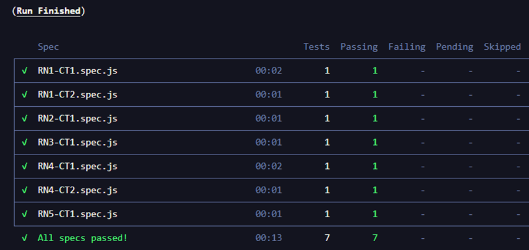

## Contexto
Este repositório contém a avaliação técnica para a DOT Digital Group, com foco na automação de testes usando Cypress. Abaixo estão os detalhes solicitados para a criação do projeto, incluindo a história do usuário, critérios de aceite, casos de teste, estimativa de tempo e os testes automatizados.

##### Contexto do teste:
Abaixo, estão as instruções para a realização da avaliação técnica.
O objetivo é conhecermos um pouco mais da sua entrega:
1. Escolha um site de sua preferência, os fluxos de sua preferência e realize os passos:
2. Escreva a história do usuário e critérios de aceite
3. Escreva os casos de testes
4. Estime o tempo de teste e demonstre como fez o cálculo
5. [Cypress] Desenvolva os testes automatizados dos fluxos que entender - demonstre a sua escolha
6. [github actions] Crie o arquivo de pipeline para a execução dos seus testes
7. [Github] Disponibilize o link do github com seu código versionado

## Configuração da máquina
  _  |  _ | 
:------: | :------: |
Nome do Sistema Operacional | Microsoft Windows 10 Pro |
Versão 10.0.19045 | Compilação 19045 |
Fabricante do sistema | Dell Inc |
Tipo do sistema | PC baseado em X64 |
Processador | Intel(R) Core(TM) i5-10210U CPU @ 1.60GHz, 2112 Mhz) |
Memória Física (RAM) Instalada | 16,0 GB |
Browser | Chrome Versão 126.0.6478.127 (Versão oficial) 64 bits |

## Pré-requisitos

Para clonar e executar este projeto, você precisará de:

- [git](https://git-scm.com/downloads) (usando versão `2.48.1.windows.1` )
- [Node.js](https://nodejs.org/pt/download/package-manager) (usando versão `v20.17.0`)
- npm (usando versão `10.8.2`)
- Visual Studio Code (usando versão `1.98.2`)

**Observação:** Ao instalar o Node.js, o npm é instalado automaticamente.

## Instalação
### Baixar o projeto
1. Crie uma pasta para clonar o projeto
2. Clone este repositório: `git clone <URL_DO_REPOSITORIO>`
3. Navegue até o diretório do projeto: `cd <PASTA_DO_PROJETO>`

### Instalar dependências
Para instalar as dependências de desenvolvimento, execute: `npm install`.
 OBS.: Se houver algum problema em instalar as dependências, execute os três comandos na pasta do projeto, respectivamente: 
1. `npm init` 
2. `Npm install`
3. `Npm install cypress -—save-dev`

### Executando os testes
Para executar todos os testes em linha de comando, execute: `npm run cy_run`
 Para executar todos os testes em interface cypress: `npm run cy_open`

### Relatório dinâmico dos testes
Para verificar o relatório local, execute: `npm run report:allure`  
Para verificar o relatório da última pipeline carregada, **[visite aqui](https://rafatrl.github.io/automa_DOT/)**.

## Resultado
Resultado executado com headless:  

#### 📄 Para visualizar o relatório completo, ([clique aqui](https://github.com/Rafatrl/automa_DOT/blob/master/docs/relat%C3%B3rio.pdf))

#### EXTRAS
##### Vídeos dos testes manuais, vá na pasta: /docs/testes manuais/
##### Exemplo de template de bug, ([clique aqui](https://github.com/Rafatrl/automa_DOT/blob/master/docs/Bugs%20encontrados.pdf))
